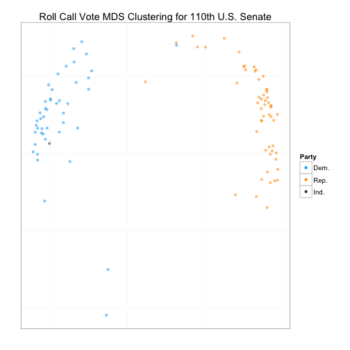
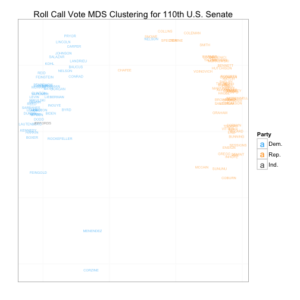
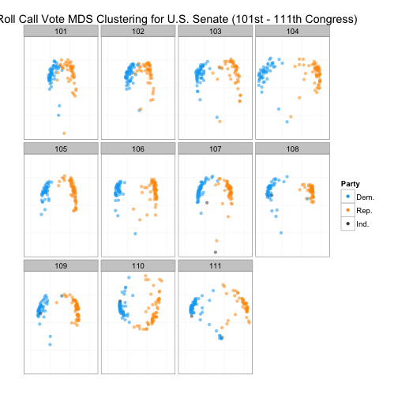

Explorando similaridad en el senado de Estados Unidos
========================================================
author: Datata
date: http://datata.mx

Introducción
=============
Este es un ejemplo de cómo el uso de datos nos puede ayudar a tomar decisiones eficientes. Con el uso de herramientas computacionales y modelos matemáticos aplicados a nuestros datos, lograremos mostrar similitudes entre los distintos senadores de Estados Unidos. Se hace énfasis en lograr una manera de visualizar los datos que sea clara y eficiente.

Datos
=============
Antes de modelar necesitamos recolectar datos. A continuación se presenta una muestra de los datos que se utilizaron para este modelo.

```
  cong    id state dist  lstate party eh1 eh2
1  101 99908    99    0 USA       200   0   0
2  101 14659    41    0 ALABAMA   100   0   1
3  101 14705    41    0 ALABAMA   100   0   1
4  101 12109    81    0 ALASKA    200   0   1
5  101 14907    81    0 ALASKA    200   0   1
6  101 14502    61    0 ARIZONA   100   0   1
```


=====

```
         name V1 V2 V3 V4 V5 V6 V7 V8 V9
1 BUSH         1  1  1  1  1  1  1  1  1
2 SHELBY, RIC  1  1  1  1  1  1  1  1  1
3 HEFLIN, HOW  1  1  1  1  1  1  1  1  1
4 STEVENS, TH  1  1  1  1  1  1  1  1  1
5 MURKOWSKI,   1  1  1  1  1  1  1  1  1
6 DECONCINI,   1  1  1  1  1  1  1  1  1
```

```
  V631 V632 V633 V634 V635 V636 V637 V638
1    9    9    9    9    9    9    9    1
2    1    1    1    1    1    1    1    6
3    1    1    1    1    1    1    1    6
4    1    1    6    6    1    1    1    1
5    1    1    6    6    1    1    1    6
6    1    1    1    1    1    1    1    6
```


Descripción de las variables
===========
Las primeras variables (cong, id, state, dist, lsatate) nos indican el congreso, estado y distrito de cada senador. Estas sirven para tener un registro detallado del individuo que estamos analizando. Las siguientes variables representan lo siguiente:

- Party: 100 = Dem, 200 = Repub.
- eh1: Occupancy. 0 = only occupant, 1 = 1st occupant, etc.
- eh2: Representa la forma en la que fue electo. 1 = general election, 2 = special election, 3 = elected by state legislature, 5 = appointed.


=======
- Nombre
- 638 variables que indican sus votos: 0 = not a member, 1 = Yea, 2 = Paired Yea, 3 = Announced Yea, 4 = Announced Nay, 5 = Paired Nay, 6 = Nay, 7 = Present, 8 = Present, 8 = Not Voting.

Esta es la forma en que se registra en Estados Unidos la información. Sin embargo, podemos adaptar el modo de guardar los datos según nuestras necesidades.

Para más información de los datos visitar: <http://www.voteview.com/>.


Manipulación de datos
============
Para este ejemplo simplificamos los datos obtenidos. Solo nos interesa saber el nombre y partido de cada senador. Además simplificaremos los votos en "a favor", "en contra" y "no voto". Para esto unimos los distintos tipos de "Yeas" indicando con "1", los distintos tipos de "Nays" indicando con "-1", y las faltas de votos indicando con "0".


Modelo de similitud
===========

Ya que tenemos los datos listos para procesarlo, creamos una métrica que nos permitirá medir "distancias" entre senadores, a través de normas matriciales aplicadas a los datos. Posteriormente usamos un algoritmo de "escalado multidireccional", el cual crea un sistema de coordenadas para cada senador que nos permitirá graficarlos y que representarán las distancias entre ellos.


```
           x        y      name party
2  -11.44068 293.0001    SHELBY   100
3  283.82580 132.4369    HEFLIN   100
4  885.85564 430.3451   STEVENS   200
5 1714.21327 185.5262 MURKOWSKI   200
6 -843.58421 220.1038 DECONCINI   100
7 1594.50998 225.8166    MCCAIN   200
```


Visualización de datos
=============
 


=======
 

========
 


